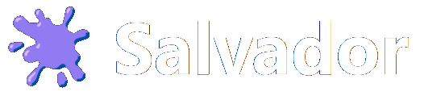
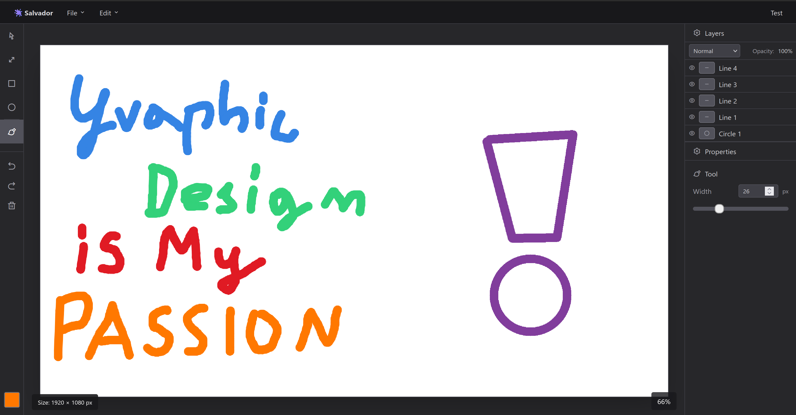

<div align="center">
  
  
  **Browser-based graphics editor inspired by Photoshop and GIMP**
  
  [](https://nextjs.org/)
  [](https://www.typescriptlang.org/)
  [](https://tailwindcss.com/)
</div>

---

## About

Salvador is a pixel-based graphics editor built as a university project for **Computer Graphics** course at **Bialystok University of Technology**. Named after the legendary artist **Salvador Dalí**, it aims to bring professional image editing capabilities directly to your browser.

<div align="center">
    
</div>


## Tech Stack

- **Next.js** - React framework
- **TypeScript** - Type-safe development
- **Canvas API** - Low-level pixel manipulation
- **Tailwind CSS** - Styling

## Getting Started

```bash
npm install
npm run dev
```
Open [http://localhost:3000](http://localhost:3000) to start creating!

or check out demo at: [https://pajojeku.github.io](https://pajojeku.github.io)

---
